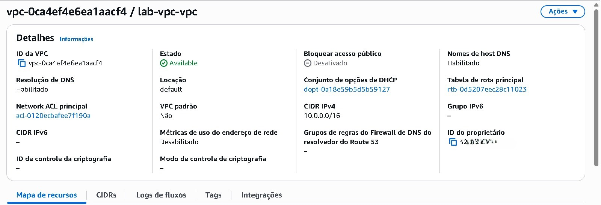
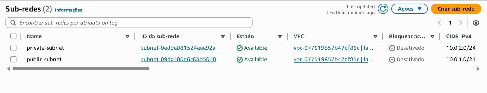
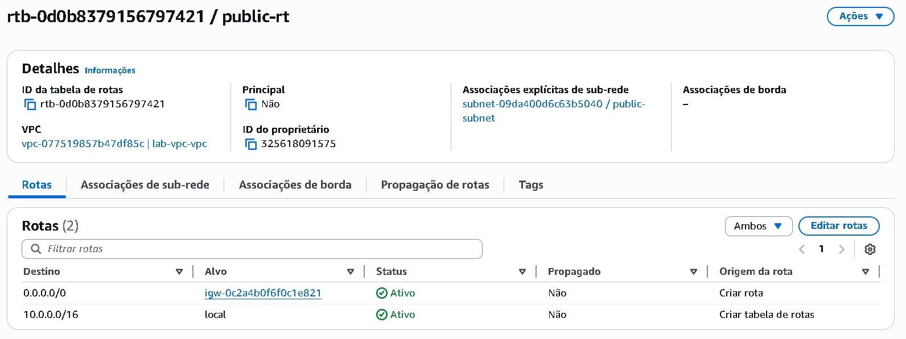
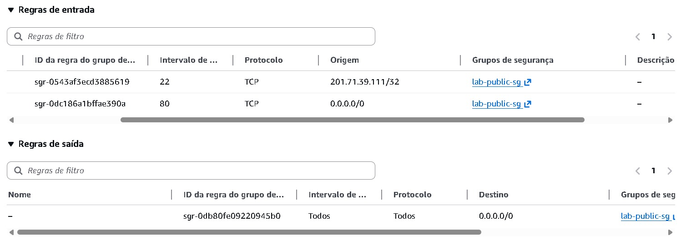
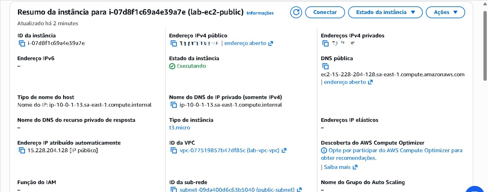
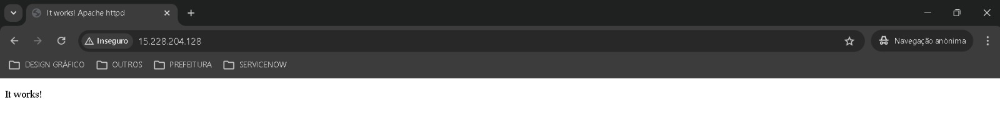

# 🇧🇷 VERSÃO EM PORTUGUÊS

---

## 📐 DIAGRAMA DE ARQUITETURA

```
       Internet
          |
  [Internet Gateway]
          |
-------------------------
|        VPC            |
|    10.0.0.0/16       |
|                      |
|  Public Subnet       |
|  10.0.1.0/24         |
|    |                 |
| [EC2 Public]         |
|    |                 |
| Route Table:         |
| 0.0.0.0/0 → IGW      |
|                      |
|----------------------|
|  Private Subnet      |
|  10.0.2.0/24         |
|    |                 |
| [EC2 Private]        |
|    |                 |
| Route Table:         |
| (sem internet)       |
-------------------------
```

---

## 🎯 OBJETIVO

* Criar uma VPC com segmentação de rede
* Implementar subnet pública e privada
* Configurar acesso à internet via Internet Gateway
* Demonstrar isolamento de recursos

Projetar e implantar uma arquitetura de VPC personalizada na AWS contendo subnets pública e privada, configurar conectividade com a internet e lançar uma instância EC2 acessível via SSH e HTTP.

Este laboratório reforça o entendimento prático de redes na AWS, comportamento de roteamento e controles de segurança.

---

## 🧠 VISÃO GERAL DE ARQUITETURA

Este laboratório demonstra a criação de uma VPC customizada na AWS, incluindo subnets públicas e privadas, com o objetivo de entender isolamento de rede e controle de acesso.

* A VPC foi criada com o bloco CIDR `10.0.0.0/16`, permitindo expansão futura.
* A subnet pública (`10.0.1.0/24`) possui acesso à internet via Internet Gateway.
* A subnet privada (`10.0.2.0/24`) não possui acesso direto à internet, garantindo isolamento.
* As rotas foram configuradas separadamente para cada subnet.

---

## 🌐 FLUXO DE COMUNICAÇÃO

1. Recursos na subnet pública acessam a internet através do Internet Gateway.
2. Recursos na subnet privada não possuem acesso direto à internet.
3. A comunicação entre subnets ocorre internamente via rede da VPC.

---

## 🔐 SEGURANÇA

* Subnet privada isolada da internet
* Controle de tráfego via route tables
* Uso de arquitetura segmentada para reduzir a superfície de ataque

---

## 💰 CUSTOS

Este laboratório utiliza recursos dentro do Free Tier (VPC, subnets e route tables).

Não há custos adicionais significativos, exceto se instâncias EC2 forem adicionadas.

---

## ⚠️ LIMITAÇÕES

* A subnet privada não possui acesso à internet (sem NAT Gateway).
* Este ambiente não é adequado para aplicações que exigem acesso externo.

---

## 🖥️ INSTÂNCIA EC2 EM EXECUÇÃO

---

## 🌍 VALIDAÇÃO HTTP

---

## ⚙️ ETAPAS EXECUTADAS

1. Criação manual de VPC customizada
2. Definição de subnet pública e privada
3. Habilitação de IP público automático na subnet pública
4. Criação e associação do Internet Gateway
5. Configuração da tabela de rotas pública
6. Associação da tabela de rotas à subnet pública
7. Criação de instância EC2 Amazon Linux
8. Configuração das regras de Security Group
9. Instalação manual do servidor Apache (httpd)
10. Validação de conectividade via SSH e navegador

---

## 🛠️ PROBLEMAS ENCONTRADOS

* Erro "Connection Refused" ao acessar via navegador
* Causa: serviço web não estava instalado ou ativo
* Solução: instalação e habilitação do Apache via `systemctl`

---

## 📚 APRENDIZADOS TÉCNICOS

* Subnet pública exige IGW e associação correta de rota
* Security Groups funcionam como firewall stateful
* Instâncias EC2 não respondem HTTP sem aplicação ativa
* Diferença prática entre Stop e Terminate
* Compreensão do fluxo de rede dentro da AWS

---


📸 ScreeShots














