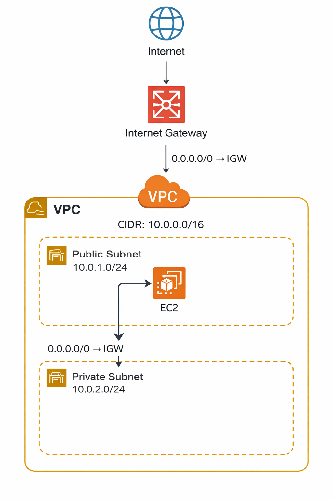

# AWS Custom VPC Lab – Public & Private Subnets + EC2 Deployment

Hands-on AWS infrastructure lab focused on networking fundamentals, security configuration and EC2 deployment in a custom VPC environment.

---

# 🇺🇸 English Version

## Objective

Design and deploy a custom AWS VPC architecture with public and private subnets, configure internet connectivity, and launch an EC2 instance accessible via SSH and HTTP.

This lab reinforces practical understanding of AWS networking, routing behavior, and security controls.

---

## Architecture Overview

- VPC CIDR: 10.0.0.0/16
- Public Subnet: 10.0.1.0/24
- Private Subnet: 10.0.2.0/24
- Internet Gateway attached to VPC
- Public Route Table with route:
  - 0.0.0.0/0 → Internet Gateway
- EC2 instance deployed in public subnet
- Security Group allowing:
  - SSH (Port 22 – restricted to My IP)
  - HTTP (Port 80 – 0.0.0.0/0)

---

## VPC Configuration

---

## Subnets Configuration

---

## Route Table Configuration

---

## Security Group Rules

---

## EC2 Instance Running

---

## HTTP Validation

---

## Steps Performed

1. Created a custom VPC manually.
2. Defined public and private subnets.
3. Enabled auto-assign public IP for the public subnet.
4. Created and attached an Internet Gateway.
5. Configured a public route table with default route to IGW.
6. Associated route table with public subnet.
7. Launched Amazon Linux EC2 instance.
8. Configured Security Group rules (SSH + HTTP).
9. Installed Apache (httpd) manually.
10. Validated connectivity via SSH and browser.

---

## Issues Faced

- Initial HTTP access returned "Connection Refused".
- Root cause: Web server service was not installed or running.
- Resolution: Installed and enabled Apache using systemctl.

---

## Key Technical Learnings

- Public subnet requires both IGW and route table association.
- Security Groups act as stateful firewalls.
- EC2 instances do not serve HTTP without an active application.
- Difference between stopping and terminating an EC2 instance.
- Practical understanding of AWS networking flow.

---
📸 screeshots

