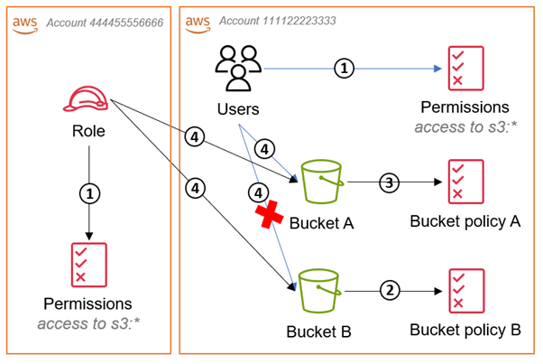

# AWS Lab — IAM User Access to S3 Bucket

---

## 🇧🇷 VERSÃO EM PORTUGUÊS

---

## 📐 DIAGRAMA DE ACESSO

```
[IAM User]
     |
     |  Request (S3 Action)
     ↓
     [IAM Policy Evaluation]
            |
      ✅ Allow / ❌ Deny
            |
            ↓
        [S3 Bucket]
```

---

## 📌 DESCRIÇÃO

Este laboratório demonstra como configurar controle de acesso ao Amazon S3 utilizando AWS IAM.

O objetivo é permitir que um usuário IAM específico tenha acesso controlado a um bucket S3 utilizando políticas de permissão (IAM Policies), seguindo o princípio de **Least Privilege (Menor Privilégio)**.

---

## 🏗️ ARQUITETURA

---

## ⚙️ RECURSOS UTILIZADOS

* AWS IAM
* Amazon S3
* IAM Policies
* AWS Console

---

## 👤 USUÁRIO IAM CRIADO

```
lab-user-s3
```

---

## 🪣 BUCKET S3 CRIADO

```
lab-iam-s3-access-ti
```

---

## 🔐 PERMISSÕES CONFIGURADAS

Policy personalizada permitindo apenas ações específicas:

* `s3:ListBucket` → listar objetos no bucket
* `s3:GetObject` → baixar arquivos
* `s3:PutObject` → enviar arquivos

A ação `s3:DeleteObject` **não foi permitida**, garantindo maior controle e segurança.

---

## 🧾 EXEMPLO DE POLICY (SIMPLIFICADA)

```json
{
  "Version": "2012-10-17",
  "Statement": [
    {
      "Effect": "Allow",
      "Action": [
        "s3:ListBucket"
      ],
      "Resource": "arn:aws:s3:::lab-iam-s3-access-ti"
    },
    {
      "Effect": "Allow",
      "Action": [
        "s3:GetObject",
        "s3:PutObject"
      ],
      "Resource": "arn:aws:s3:::lab-iam-s3-access-ti/*"
    }
  ]
}
```

---

## 🌐 FLUXO DE ACESSO

1. Usuário IAM realiza login na AWS
2. Uma requisição é feita para acessar o S3
3. O IAM avalia as políticas associadas ao usuário
4. A requisição é permitida ou negada
5. O S3 responde de acordo com a decisão

---

## 🚫 OPERAÇÕES NÃO PERMITIDAS

* Exclusão de objetos (`DeleteObject`)

---

## 📤 TESTE REALIZADO

Upload de arquivo `.txt` no bucket utilizando o usuário IAM configurado.

Resultado esperado:

* ✅ Upload permitido
* ❌ Delete bloqueado

---

## 🎯 OBJETIVO DO LABORATÓRIO

Demonstrar na prática:

* Criação de usuário IAM
* Criação de policy customizada
* Controle de acesso ao S3
* Aplicação do princípio **Least Privilege**

---

## 📚 APRENDIZADOS TÉCNICOS

* IAM avalia permissões antes de permitir acesso
* Permissões devem ser definidas por ação e recurso
* Separação entre permissões de bucket e objetos
* Aplicação prática do princípio de menor privilégio

---

## ⚠️ BOAS PRÁTICAS

* Evitar permissões amplas (`*`)
* Definir ações específicas
* Restringir acesso ao mínimo necessário
* Revisar policies regularmente

---
📸 ScreenShots

