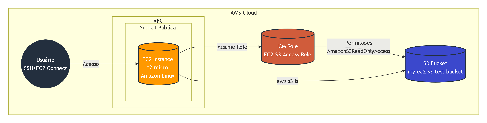
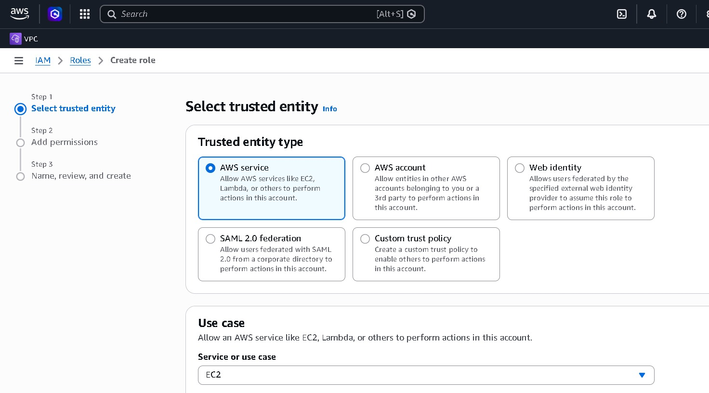
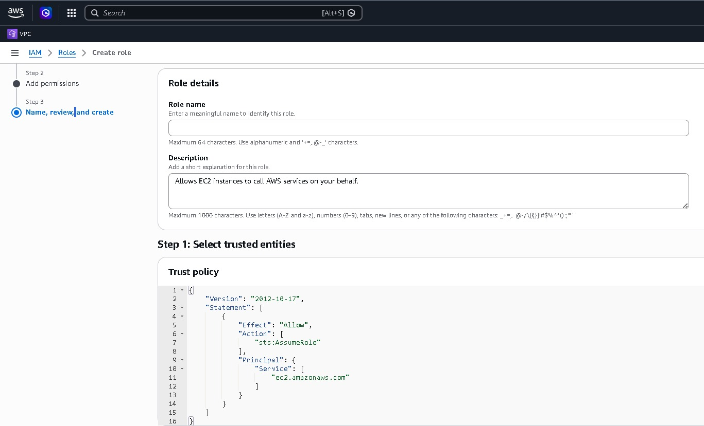
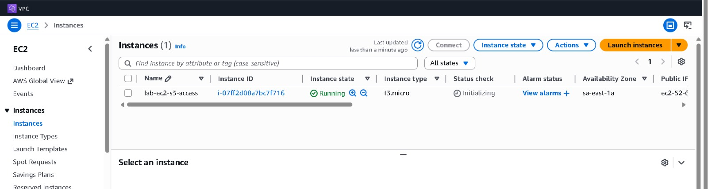
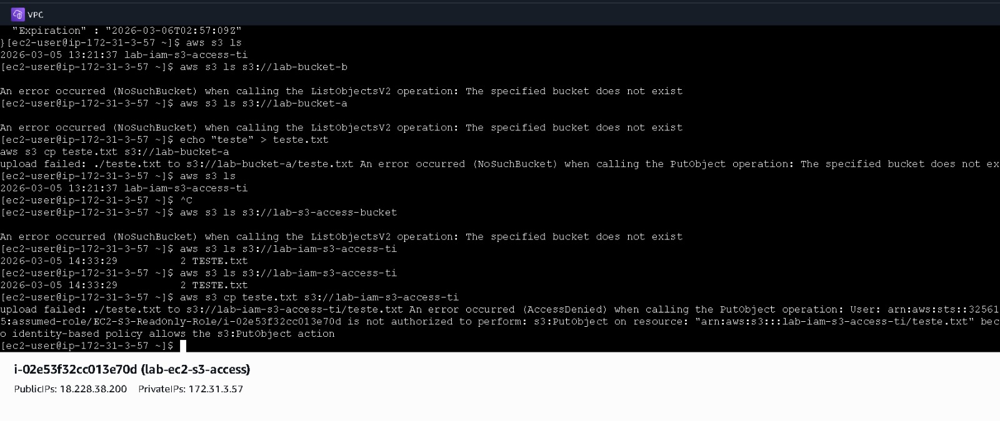

## 🇧🇷 Português



### Visão Geral do Projeto

Este projeto demonstra como configurar acesso seguro entre uma instância EC2 e um bucket S3 utilizando uma IAM Role.

Em vez de armazenar credenciais da AWS dentro da instância, a EC2 assume uma IAM Role que concede permissão para acessar o bucket S3.

Essa abordagem segue as boas práticas de segurança da AWS e o princípio do menor privilégio.

### Arquitetura

Componentes utilizados:

- EC2 Instance: executa comandos para interagir com o S3
- IAM Role: concede permissão para a EC2 acessar o S3
- S3 Bucket: armazena os arquivos acessados pela EC2

Fluxo de acesso:

EC2 Instance → IAM Role → S3 Bucket

### Tecnologias Utilizadas

- Amazon EC2
- Amazon S3
- AWS IAM
- AWS CLI
- Amazon Linux

### Etapas Realizadas

#### 1. Criar um Bucket S3

1. Acesse o AWS S3 Console
2. Clique em Create bucket
3. Utilize as configurações padrão de segurança

Exemplo de nome do bucket:

my-ec2-s3-test-bucket

#### 2. Criar uma IAM Role

1. Vá em IAM → Roles
2. Clique em Create Role
3. Selecione AWS Service
4. Escolha EC2
5. Anexe a policy:

AmazonS3ReadOnlyAccess

6. Nome da role:

EC2-S3-Access-Role

#### 3. Criar a Instância EC2

1. Acesse EC2 → Launch Instance
2. Escolha Amazon Linux
3. Tipo de instância: t2.micro
4. Em IAM Role selecione:

EC2-S3-Access-Role

#### 4. Conectar na Instância

Conecte utilizando SSH ou EC2 Instance Connect.

Atualize os pacotes:

```bash
sudo yum update -y
```

Verifique a versão do AWS CLI:

```bash
aws --version
```

#### 5. Testar Acesso ao S3

Listar buckets:

```bash
aws s3 ls
```

Listar arquivos dentro do bucket:

```bash
aws s3 ls s3://my-ec2-s3-test-bucket
```

Se configurado corretamente, a instância EC2 conseguirá acessar o S3 sem utilizar chaves de acesso.

### Estrutura do Projeto

```
### Principais Aprendizados

- Uso de IAM Roles para melhorar a segurança na AWS
- Permitir que EC2 acesse serviços AWS sem armazenar credenciais
- Uso básico do AWS CLI com S3
- Implementação prática do princípio do menor privilégio


📸 Screenshots
 






