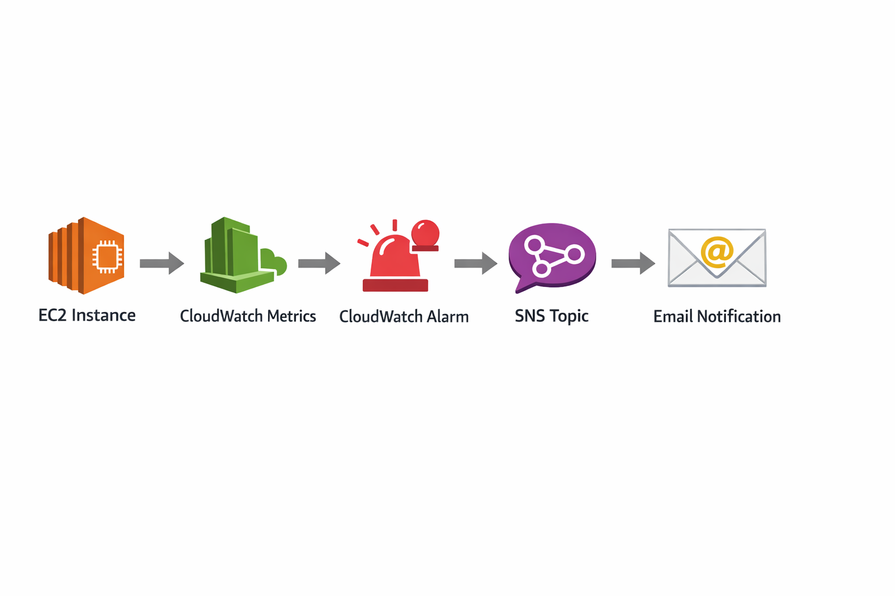
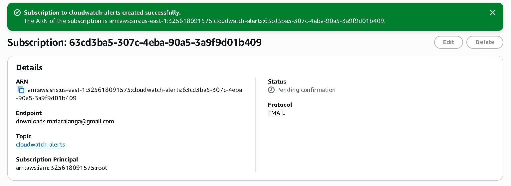
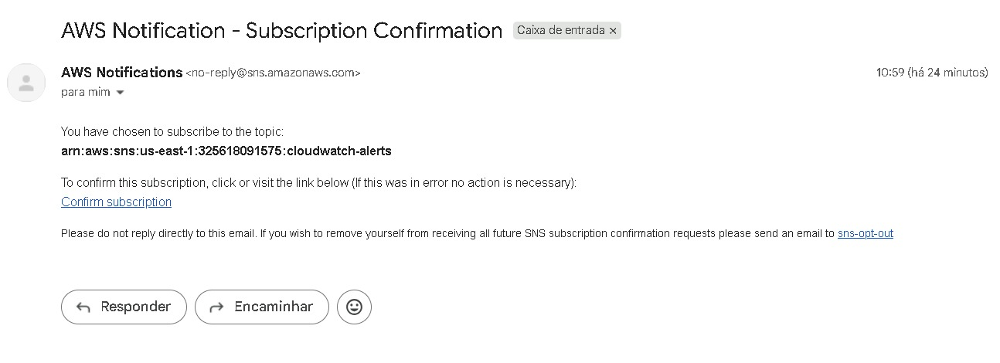
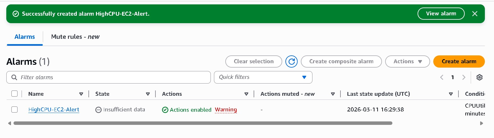
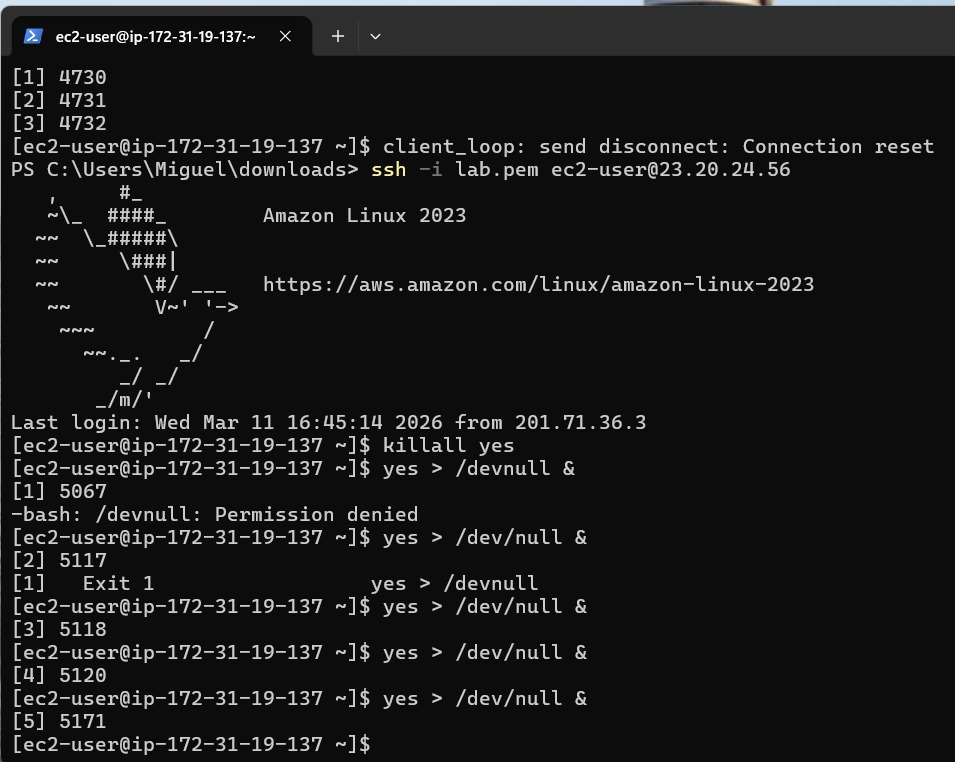
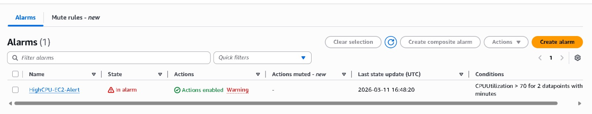

# EN Monitoring and Alerts with CloudWatch

## Overview

This lab demonstrates how to monitor an EC2 instance using Amazon CloudWatch and automatically send alerts when resource usage exceeds a defined threshold.

The objective is to simulate a real operational scenario where infrastructure monitoring detects problems and notifies the responsible team.

---

## Architecture

EC2 Instance → CloudWatch Metrics → CloudWatch Alarm → SNS Topic → Email Notification

---

## Services used

- Amazon EC2
- Amazon CloudWatch
- Amazon Simple Notification Service (SNS)

---

## Objective

Configure an alarm that triggers when: CPUUtilization > 70% for 2 consecutive minutes. This simulates a server with abnormal CPU usage.

---

## Step by Step

**Step 1 – Create an EC2 instance**  
Create a test instance using: Type: t2.micro / AMI: Amazon Linux 2023

**Step 2 – Create a CloudWatch Alarm**  
Access: CloudWatch → Alarms → Create Alarm  
Select the metric: EC2 → Per-Instance Metrics → CPUUtilization

**Step 3 – Define Alarm Condition**  
Configuration: CPUUtilization > 70% / Evaluation periods: 2 / Period: 1 minute

**Step 4 – Configure Notification**  
Create an SNS topic and register an email to receive alerts.

**Step 5 – Generate CPU Load**  
Connect via SSH to the instance and run: yes > /dev/null & (run 3 times)

**Step 6 – End the Test**  
To stop CPU consumption: killall yes

---

## Result

The alarm changes state: OK → ALARM and sends an email notification through SNS.

---

## Skills Demonstrated

- Infrastructure monitoring
- Alarm creation
- Alert automation
- Observability in cloud environments

---

## 📷 Screenshots

