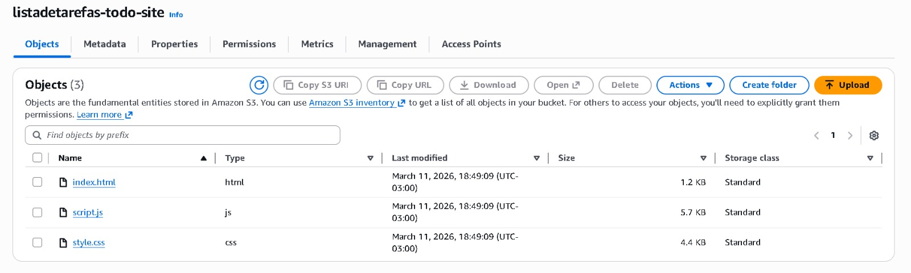
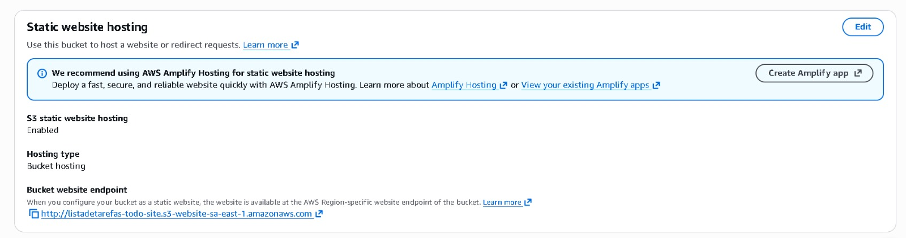
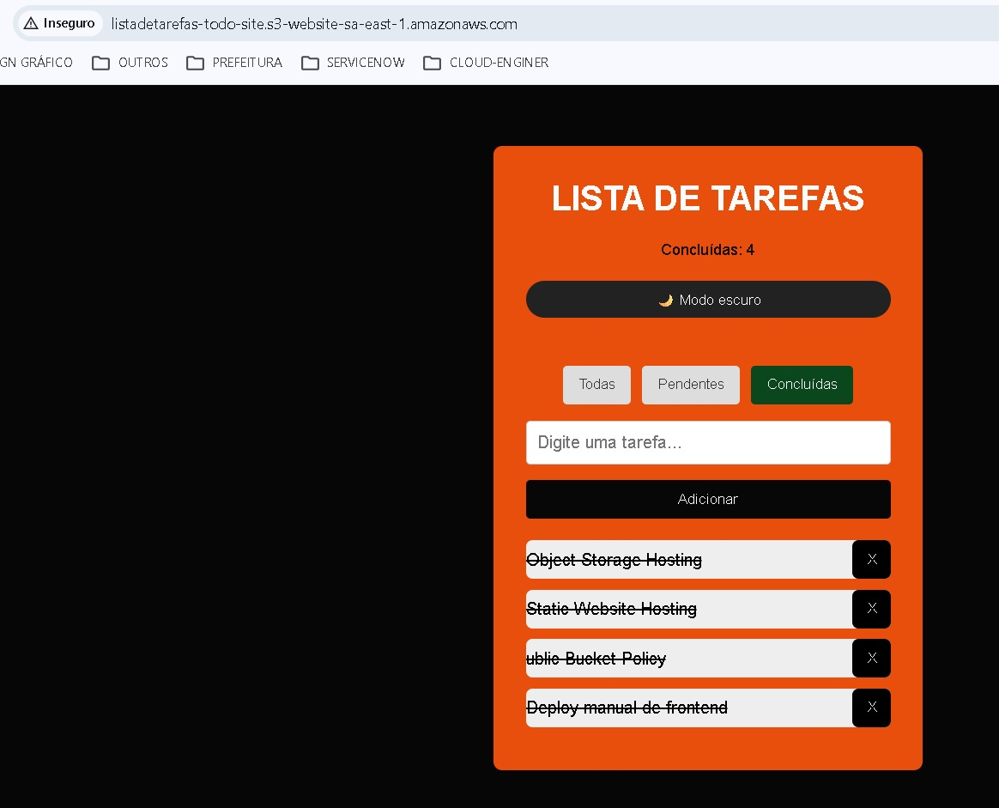
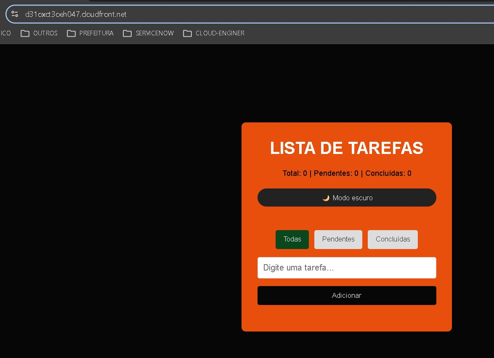
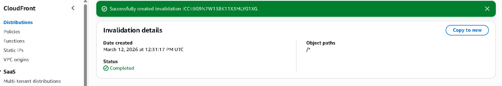
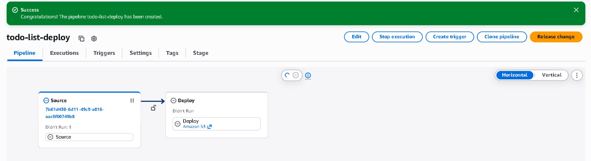
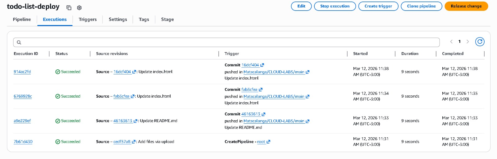

# ☁️ Laboratório 07 — Deploy de Site Estático na AWS com CI/CD


## 📌 Objetivo

Neste laboratório foi implementado o deploy de um **site estático (HTML, CSS e JavaScript)** utilizando serviços da AWS e integração com GitHub para **deploy automático**.

O objetivo foi aprender na prática como funciona um fluxo simples de **CI/CD para aplicações frontend**.

---

Serviços utilizados:

* Amazon S3
* Amazon CloudFront
* AWS CodePipeline
* AWS CodeStar Connections
* GitHub

---

# 🚀 Etapas do Laboratório

## 1️⃣ Criação do Bucket S3

Foi criado um bucket para hospedar os arquivos do site.

Bucket utilizado:

```
listadetarefas-todo-site
```

O bucket foi configurado com **Static Website Hosting** habilitado.

---

## 2️⃣ Upload do Frontend

Foi realizado o upload dos arquivos do projeto:

```
index.html
style.css
script.js
```

O site consiste em uma aplicação simples de **Lista de Tarefas (Todo List)**.

Funcionalidades:

* Adicionar tarefas
* Marcar tarefas como concluídas
* Remover tarefas
* Alternar modo escuro

---

## 3️⃣ Configuração do Static Website Hosting

Foi configurado o documento inicial:

```
index.html
```

Após a configuração, o site já podia ser acessado diretamente pelo endpoint do S3.

---

## 4️⃣ Criação da CDN com CloudFront

Foi criada uma distribuição no **Amazon CloudFront** utilizando o bucket S3 como origem.

Benefícios da CDN:

* Cache global
* Melhor desempenho
* Redução de latência
* Distribuição geográfica

Endpoint gerado:

```
https://d31oxct3oeh047.cloudfront.net
```

---

## 5️⃣ Integração com GitHub

Foi criada uma conexão entre a AWS e o GitHub utilizando **AWS CodeStar Connections**.

Connection name:

```
github-connection
```

Repositório utilizado:

```
Matacalanga/CLOUD-LABS
```

Branch monitorada:

```
main
```

---

## 6️⃣ Criação do Pipeline CI/CD

Foi criado um pipeline utilizando **AWS CodePipeline**.

Nome do pipeline:

```
todo-list-deploy
```

### Stage: Source

Origem configurada:

```
GitHub Repository
```

Trigger automático configurado para:

```
push na branch main
```

---

### Stage: Build

Esta etapa foi **ignoradа**, pois o projeto é um site estático.

---

### Stage: Test

Também foi **ignorada**, pois não existem testes automatizados configurados.

---

### Stage: Deploy

O deploy foi configurado para o serviço:

```
Amazon S3
```

Bucket de destino:

```
listadetarefas-todo-site
```

Opção habilitada:

```
Extract file before deploy
```

Isso garante que os arquivos sejam extraídos corretamente no bucket.

---

# 🔄 Teste de Deploy Automático

Para validar o funcionamento do pipeline foi realizado o seguinte teste:

1. Alteração no arquivo `index.html`
2. Commit enviado para o GitHub
3. O CodePipeline detectou automaticamente a mudança
4. O deploy foi executado no S3
5. O site foi atualizado

Tempo médio de execução:

```
~9 segundos
```

---

# ⚠️ Observação sobre Cache

Como o site utiliza **Amazon CloudFront**, pode ocorrer atraso na atualização devido ao cache da CDN.

Para forçar a atualização foi criada uma invalidação utilizando:

```
/*
```

---

# 📸 Screenshots do Laboratório

### 1 — Criação do Bucket S3

(Adicionar imagem aqui)

### 2 — Upload dos Arquivos

(Adicionar imagem aqui)

### 3 — Configuração do Static Website Hosting

(Adicionar imagem aqui)

### 4 — Criação da Distribuição CloudFront

(Adicionar imagem aqui)

### 5 — Conexão com GitHub

(Adicionar imagem aqui)

### 6 — Criação do Pipeline

(Adicionar imagem aqui)

### 7 — Execução do Pipeline

(Adicionar imagem aqui)

---

# 🎯 Resultado Final

Foi implementado com sucesso um fluxo simples de **CI/CD para deploy de site estático na AWS**.

Principais aprendizados:

* Hospedagem de sites estáticos com S3
* Distribuição global utilizando CloudFront
* Integração entre AWS e GitHub
* Automação de deploy com CodePipeline
* Conceitos básicos de CI/CD

---

# 📚 Próximos Passos

Possíveis melhorias para este projeto:

* Automação de invalidação de cache do CloudFront
* Uso de GitHub Actions para deploy
* Infraestrutura como código com AWS CloudFormation ou CDK
* Adição de domínio customizado
* Configuração de HTTPS completo

  📸 VEJA:
  
  
  
  
  
  
  


