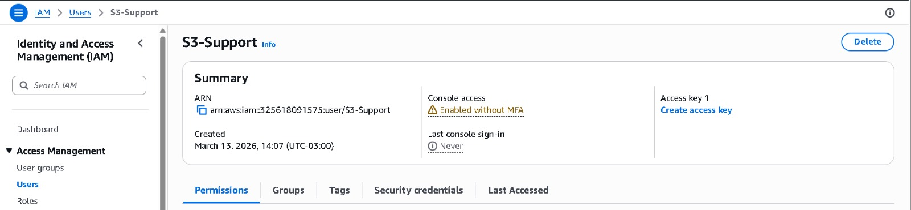
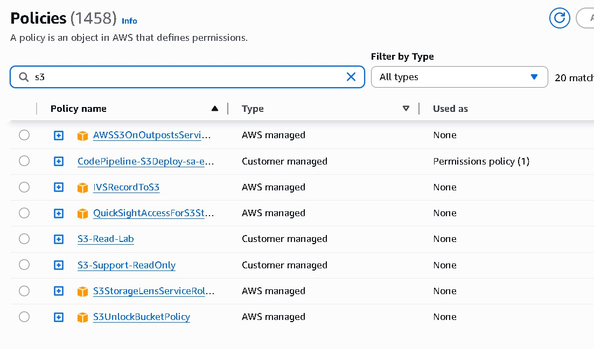
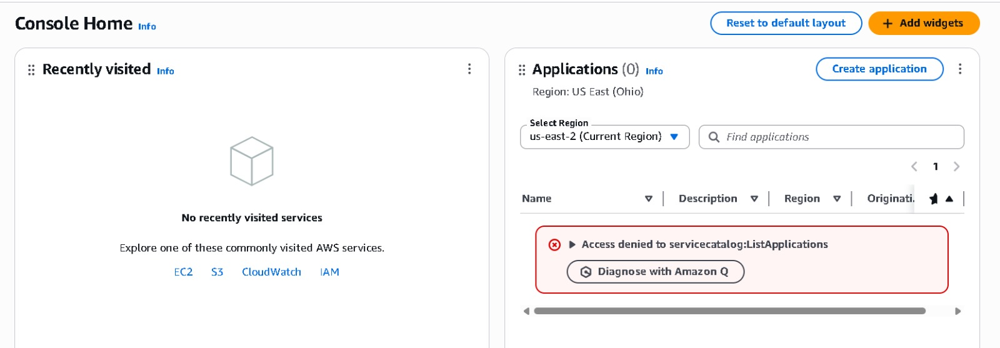
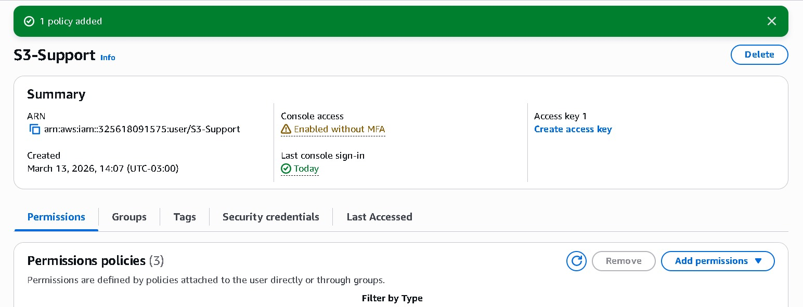

# AWS Lab 08 — IAM Least Privilege

---

## 🇧🇷 VERSÃO EM PORTUGUÊS

---

## 📐 DIAGRAMA DE AUTORIZAÇÃO

```
[IAM User]
     |
     | Request (S3 Action)
     ↓
[IAM Policy Evaluation]
     |
   ✅ Allow / ❌ Deny
     ↓
[Amazon S3]
```

---

## 📌 OBJETIVO

Demonstrar na prática o princípio de **Least Privilege**, concedendo a um usuário apenas as permissões mínimas necessárias para visualizar recursos no Amazon S3.

---

## 🧠 CONCEITO DE LEAST PRIVILEGE

O princípio de menor privilégio consiste em:

* Conceder apenas permissões necessárias
* Evitar acesso excessivo
* Reduzir riscos de segurança

Na AWS, isso significa limitar:

* Ações (`Action`)
* Recursos (`Resource`)

---

## ⚙️ RECURSOS UTILIZADOS

* AWS IAM
* Amazon S3
* IAM Policies

---

## 👤 USUÁRIO

```
s3-support
```

---

## 🔎 ESTADO INICIAL

Sem nenhuma policy associada:

* ❌ Acesso ao S3 negado
* Erro: `AccessDenied`

---

## 🔐 POLICY IMPLEMENTADA

### Permissões concedidas:

* `s3:ListAllMyBuckets`
* `s3:GetBucketLocation`

---

## 🧾 EXEMPLO DE POLICY

```json
{
  "Version": "2012-10-17",
  "Statement": [
    {
      "Effect": "Allow",
      "Action": [
        "s3:ListAllMyBuckets",
        "s3:GetBucketLocation"
      ],
      "Resource": "*"
    }
  ]
}
```

---

## ⚠️ IMPORTANTE

Essas permissões são **globais**, pois utilizam:

```
Resource: *
```

Isso permite apenas visualizar buckets, sem acesso ao conteúdo interno.

---

## 🔄 FLUXO DE AUTORIZAÇÃO

1. Usuário realiza requisição ao S3
2. IAM avalia as policies associadas
3. A ação é permitida ou negada
4. O S3 responde conforme a decisão

---

## 📤 VALIDAÇÃO

Permissões permitidas:

* Listar buckets
* Consultar localização

Permissões bloqueadas:

* Criar buckets
* Upload de arquivos
* Deletar objetos
* Alterar configurações

---

## 🧠 MELHORIA (LEAST PRIVILEGE REAL)

Exemplo mais restrito:

```json
{
  "Effect": "Allow",
  "Action": "s3:ListBucket",
  "Resource": "arn:aws:s3:::meu-bucket"
}
```

👉 Aqui o acesso é limitado a **um bucket específico**

---

## 📚 APRENDIZADOS

* IAM avalia permissões antes de permitir acesso
* Least Privilege envolve ação + recurso
* Diferença entre permissões globais e específicas
* Uso de policies em JSON

---

## ⚠️ BOAS PRÁTICAS

* Evitar `Resource: *` quando possível
* Restringir permissões por bucket
* Revisar policies regularmente

---

### 📸 ScreenShots








