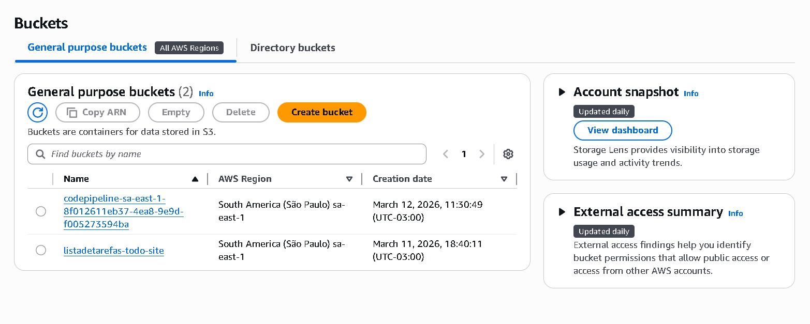

# Laboratório 08 — IAM Least Privilege na AWS

Este laboratório teve como objetivo demonstrar na prática o princípio de **Privilégio Mínimo (Least Privilege)** utilizando os serviços de identidade e armazenamento da **Amazon Web Services (AWS)**.

O princípio de **Least Privilege** é uma das principais boas práticas de segurança em ambientes de computação em nuvem. Ele consiste em conceder a usuários, aplicações ou serviços **somente as permissões estritamente necessárias para executar suas tarefas**, reduzindo riscos de acesso indevido ou alterações não autorizadas em recursos da infraestrutura.

Durante o laboratório foram utilizados os serviços **AWS Identity and Access Management (IAM)** para controle de identidade e permissões, e **Amazon S3 (Simple Storage Service)** como recurso de armazenamento para validação do acesso.

---

# Objetivo do laboratório

Configurar um usuário com permissões restritas para acessar recursos do Amazon S3, permitindo apenas operações específicas e bloqueando ações administrativas ou potencialmente destrutivas.

---

# Etapas realizadas

Inicialmente foi realizado o acesso ao **Console da AWS** utilizando um usuário disponibilizado pelo ambiente de laboratório.

Após o login, foi realizada uma tentativa de acesso ao serviço **Amazon S3**, onde foi observado o erro **Access Denied**. Esse comportamento ocorre porque o usuário não possuía nenhuma política de acesso associada, demonstrando o comportamento padrão de segurança da AWS quando permissões não são explicitamente concedidas.

Em seguida, foi acessado o serviço **AWS Identity and Access Management (IAM)** para criação de uma política personalizada de acesso.

Utilizando o editor de políticas no formato **JSON**, foi criada uma política com permissões mínimas necessárias para permitir apenas a visualização de buckets no Amazon S3.

As permissões configuradas foram:

- `s3:ListAllMyBuckets`
- `s3:GetBucketLocation`

Essas ações permitem apenas listar os buckets existentes e consultar sua localização, sem conceder permissões para criação, modificação ou exclusão de recursos.

Após a criação da política, ela foi associada diretamente ao usuário **s3-support**, demonstrando como políticas podem ser aplicadas a identidades específicas dentro da AWS.

---

# Validação das permissões

Após anexar a política ao usuário, foram realizados testes no serviço **Amazon S3** para verificar o comportamento das permissões configuradas.

Os resultados observados foram:

Permissões permitidas:

- Visualizar a lista de buckets
- Consultar informações básicas de buckets

Permissões bloqueadas:

- Criar novos buckets
- Enviar arquivos para buckets
- Excluir objetos
- Alterar configurações de buckets

Esses testes confirmaram que o usuário possui apenas permissões limitadas, garantindo a aplicação correta do princípio de **Privilégio Mínimo (Least Privilege)**.

---

# Conceitos praticados

Durante este laboratório foram aplicados os seguintes conceitos fundamentais da AWS:

- AWS IAM (Identity and Access Management)
- Criação de políticas de acesso (IAM Policies)
- Controle de permissões baseado em JSON
- Gerenciamento de identidades e permissões
- Princípio de segurança Least Privilege
- Validação prática de permissões em serviços AWS

---

# Arquitetura do laboratório

O fluxo de autorização configurado segue o modelo abaixo:

📸 Screenshots

