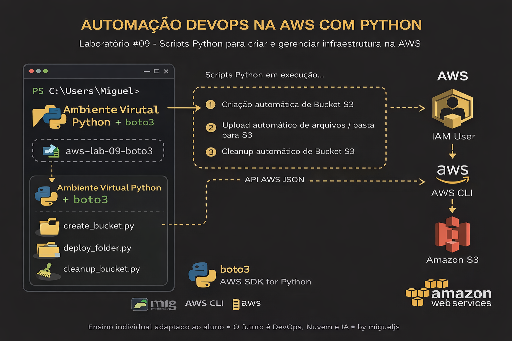
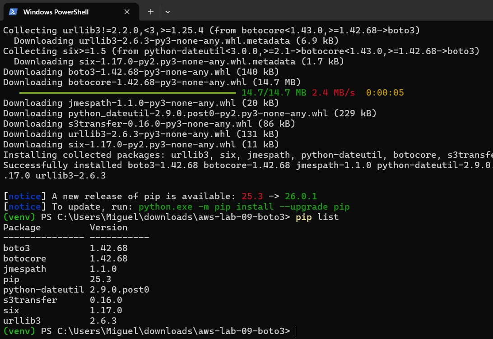
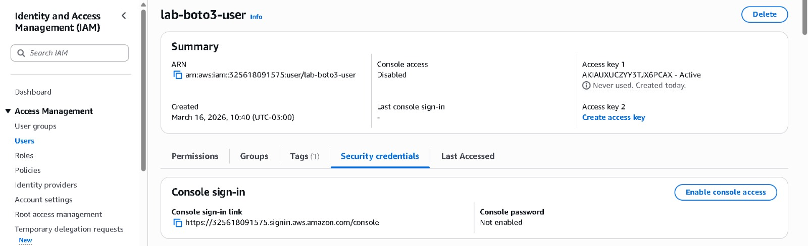
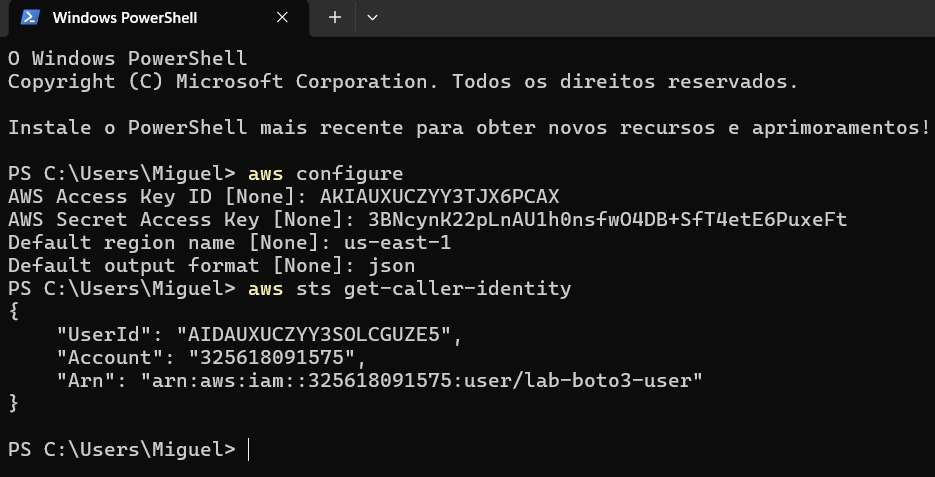
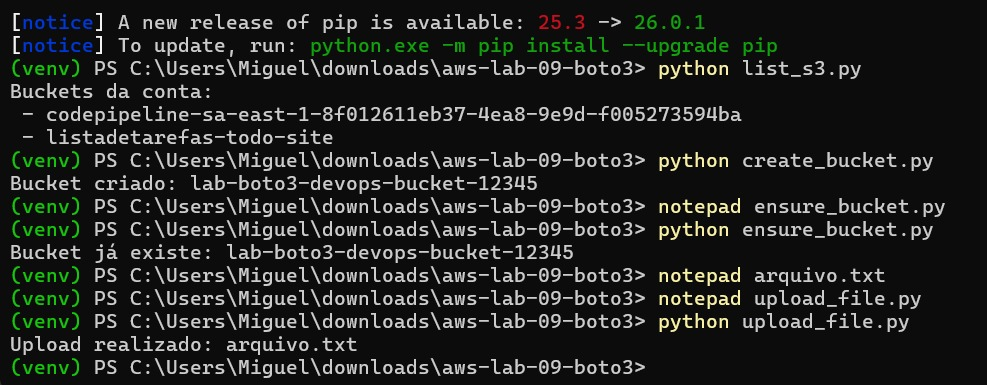
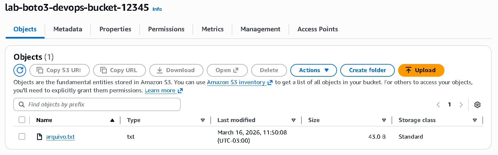

# 🚀 Lab 09 — DevOps with Python and Boto3 on AWS



This lab demonstrates, in practice, how to automate tasks on AWS using Python and the Boto3 SDK, following DevOps and Infrastructure as Code (IaC) principles.

---

## 📌 Objective

Automate AWS operations programmatically, including:

- Secure authentication via CLI
- Infrastructure provisioning (S3)
- Idempotent scripts
- File uploads
- Directory deployment
- Automated resource cleanup

---

## 🧰 Technologies Used

- Python 3.x  
- Boto3 (AWS SDK for Python)  
- AWS CLI  
- Amazon S3  
- IAM (Identity and Access Management)  

---

## 🏗️ Lab Architecture

```
[ Python Scripts ]
        ↓
[ Boto3 SDK ]
        ↓
[ AWS CLI / IAM Credentials ]
        ↓
[ AWS API ]
        ↓
[ Amazon S3 ]
```

---

## ⚙️ Prerequisites

Before starting, you will need:

- An active AWS account  
- AWS CLI installed  
- Python installed  
- An IAM user with appropriate permissions  
- A configured Python virtual environment  

---

## 🔐 Credentials Configuration

Run:

```
aws configure
```

Provide:

```
AWS Access Key ID
AWS Secret Access Key
Region: us-east-1
Output: json
```

---

## 📂 Project Structure

```
aws-lab-09-boto3/
│
├── list_s3.py
├── create_bucket.py
├── ensure_bucket.py
├── upload_file.py
├── list_objects.py
├── deploy_folder.py
├── cleanup_bucket.py
│
├── deploy/
│   ├── index.html
│   └── app.js
│
└── arquivo.txt
```

---

## 🧪 Lab Steps

### 1. List S3 Buckets

```
python list_s3.py
```

### 2. Create Bucket

```
python create_bucket.py
```

### 3. Idempotent Script

Prevents errors if the bucket already exists:

```
python ensure_bucket.py
```

### 4. Upload File

```
python upload_file.py
```

### 5. List Bucket Objects

```
python list_objects.py
```

### 6. Deploy Entire Folder

```
python deploy_folder.py
```

### 7. Cleanup Bucket

```
python cleanup_bucket.py
```

---

## 🧠 DevOps Concepts Applied

- Infrastructure automation  
- Idempotency  
- AWS API integration  
- Automated deployment  
- Reusable scripts  
- Credential management  

---

## ⚠️ Best Practices

- Never commit Access Keys to version control  
- Use least-privilege IAM policies  
- Avoid fixed bucket names (use globally unique names)  
- Use environment variables in production  
- Monitor costs in AWS Billing  

---

## 💡 Possible Extensions

- Provision EC2 instances with Boto3  
- Build CI/CD pipelines  
- Automate backups  
- Deploy a full static website  
- Integrate with Terraform  

---

## 🧹 Resource Cleanup

To avoid unnecessary costs:

```
python cleanup_bucket.py
```

Optionally delete the bucket via the AWS Console.

---

## 📚 References

- https://boto3.amazonaws.com/v1/documentation/api/latest/index.html  
- https://docs.aws.amazon.com/cli/  
- https://aws.amazon.com/s3/  

---

## 📸 Screenshots






