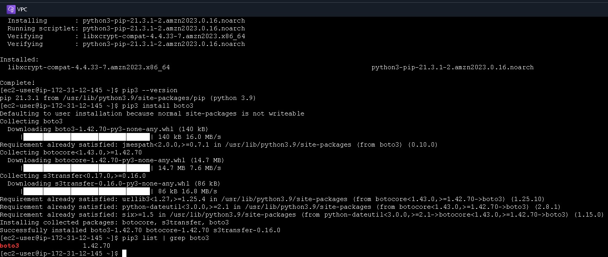
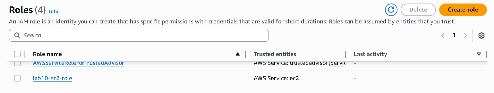
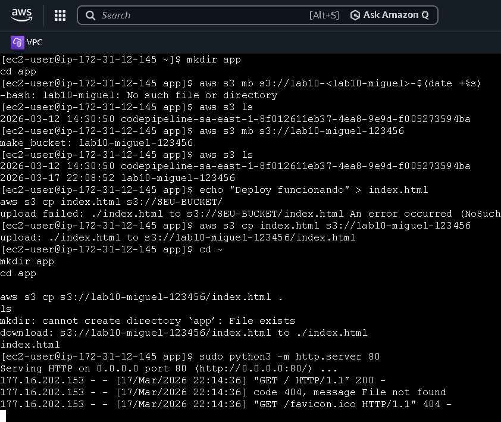
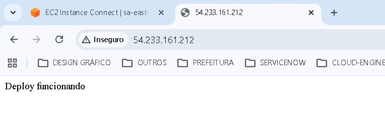

# AWS Lab 10 — Simulação de Produção com EC2, S3 e IAM

---

## 📐 DIAGRAMA DE ARQUITETURA

```
Developer
   |
   | Upload de artefato
   ↓
[Amazon S3]
   |
   | (Pull)
   ↓
[EC2 Instance]
   |
   ↓
[Aplicação Web]
```

---

## 📌 OBJETIVO

Simular um ambiente de produção na AWS utilizando EC2, S3 e IAM Role, implementando um fluxo de deploy automatizado baseado em pull.

---

## 🧠 VISÃO GERAL

Este laboratório demonstra um padrão comum em ambientes reais onde:

* Artefatos são armazenados no S3
* Servidores EC2 consomem esses artefatos
* O acesso é controlado via IAM Role
* Não há uso de credenciais fixas

---

## 🏗️ ARQUITETURA

Componentes:

* EC2 Instance (servidor de aplicação)
* Amazon S3 (armazenamento de artefatos)
* IAM Role (controle de acesso seguro)

---

## 🔐 SEGURANÇA

* Uso de IAM Role (sem access keys)
* Permissões restritas ao bucket S3
* Comunicação segura entre serviços AWS

---

## 🔄 FLUXO DE DEPLOY

1. Desenvolvedor envia arquivos para o S3
2. EC2 acessa o bucket utilizando IAM Role
3. EC2 realiza download dos arquivos
4. Aplicação é atualizada

---

## ⚙️ IMPLEMENTAÇÃO

### 1. Upload de artefato

```bash
aws s3 cp app.zip s3://meu-bucket/
```

---

### 2. Acesso via EC2

Na instância:

```bash
aws s3 cp s3://meu-bucket/app.zip .
```

---

### 3. Deploy

```bash
unzip app.zip
python app.py
```

---

## 🔐 IAM ROLE

Permissões mínimas:

```json
{
  "Effect": "Allow",
  "Action": ["s3:GetObject"],
  "Resource": "arn:aws:s3:::meu-bucket/*"
}
```

---

## 🧠 MODELO DE DEPLOY

Este laboratório utiliza o modelo:

### Pull-based deployment

Vantagens:

* EC2 controla quando atualizar
* Maior segurança
* Menor exposição

---

## 🛠️ TROUBLESHOOTING

Problemas comuns:

* ❌ AccessDenied → Role incorreta
* ❌ Bucket errado
* ❌ Arquivo não encontrado
* ❌ CLI não configurada

---

## 📚 APRENDIZADOS

* Integração EC2 + S3
* Uso de IAM Role em produção
* Deploy automatizado
* Boas práticas de segurança
* Fluxo real de aplicação

---

## ⚠️ BOAS PRÁTICAS

* Evitar credenciais fixas
* Usar nomes únicos para bucket
* Implementar logs (CloudWatch)
* Automatizar com scripts

---


## 📸screenshots








