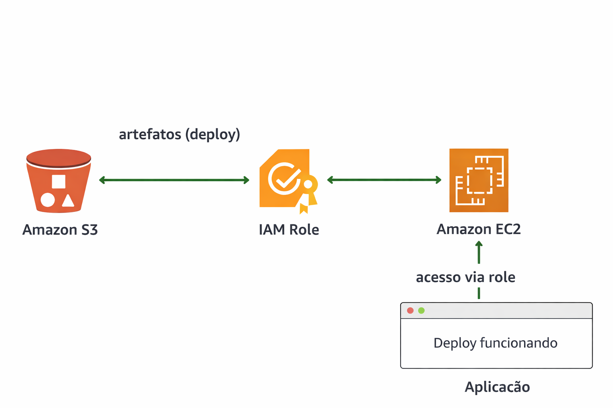

# 🚀 Lab 10 — Production Simulation with AWS (EC2 + S3 + IAM)

This lab simulates a real production environment on AWS using an EC2 instance, artifact storage in S3, and secure authentication via IAM Role, following modern DevOps best practices.

---

## 📌 Objective

Simulate a production deployment workflow, including:

- Server provisioning (EC2)
- Secure access configuration using IAM Role
- Artifact storage in S3
- Pull-based deployment (EC2 consuming from S3)
- Running a simple web application
- Full cleanup to avoid unnecessary costs

---

## 🧰 Technologies Used

- Python 3.x  
- Boto3 (AWS SDK for Python)  
- AWS CLI  
- Amazon EC2  
- Amazon S3  
- IAM (Identity and Access Management)  

---

## 📸 Screenshots

