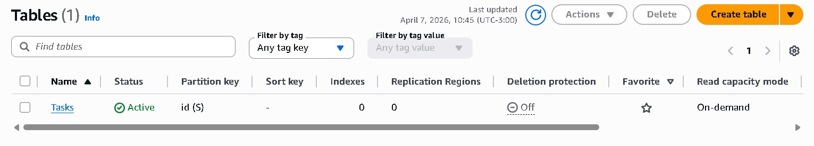
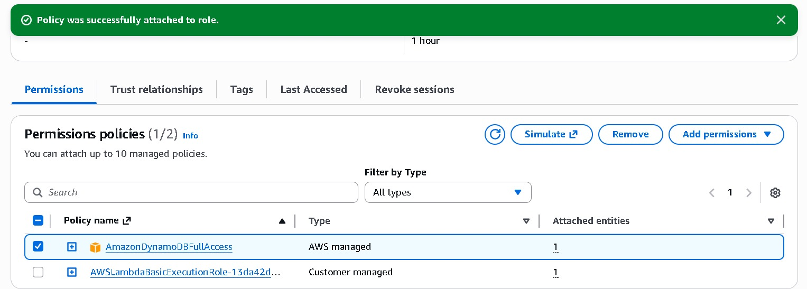
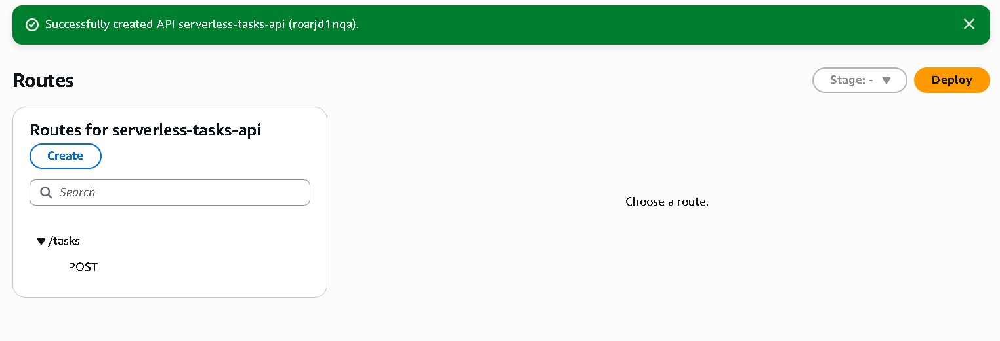
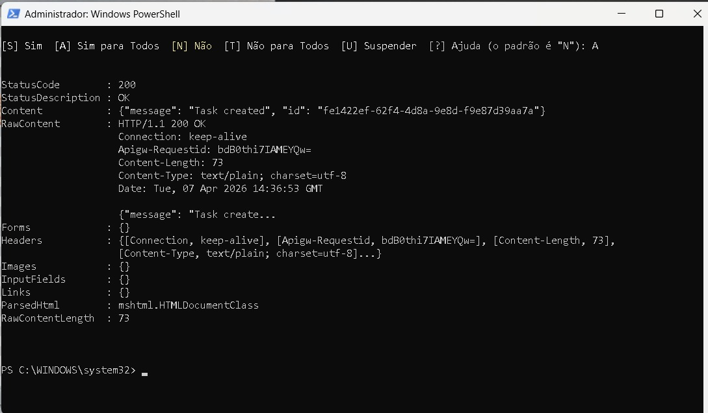
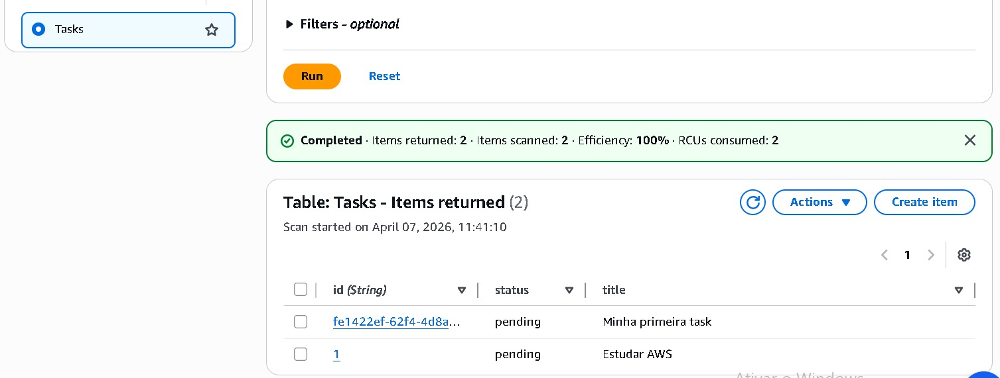

# 🧪 Lab 11 — API Serverless com AWS (API Gateway + Lambda + DynamoDB)

## 🎯 Objetivo

Criar uma API REST completamente serverless utilizando AWS, sem necessidade de provisionar servidores.

A API permitirá criar tarefas e armazená-las em um banco NoSQL com baixa latência e escalabilidade automática.

---

# 🏗 Arquitetura

Client → API Gateway → Lambda → DynamoDB

Fluxo da requisição:

POST /tasks
↓
API Gateway
↓
Lambda (createTask)
↓
DynamoDB (Tasks)

---

# 🧠 Cenário

Uma aplicação precisa de um backend simples para gerenciamento de tarefas:

* Criar tarefas
* Persistir dados
* Escalar automaticamente
* Não gerenciar servidores

A solução será totalmente serverless.

---

# 🔧 Serviços Utilizados

* Amazon API Gateway
* AWS Lambda
* Amazon DynamoDB
* AWS IAM

---

# 📦 Passo 1 — Criar tabela DynamoDB

Tabela:

Tasks

Partition key:

id (String)

Exemplo de item:

{
"id": "1",
"title": "Estudar AWS",
"status": "pending"
}

---

# 📦 Passo 2 — Criar função Lambda

Nome:

createTask

Runtime:

Python 3.12

Adicionar permissão IAM:

AmazonDynamoDBFullAccess

---

# 📦 Passo 3 — Código da Lambda

```python
import json
import boto3
import uuid

dynamodb = boto3.resource('dynamodb')
table = dynamodb.Table('Tasks')

def lambda_handler(event, context):

    body = json.loads(event['body'])

    task_id = str(uuid.uuid4())

    item = {
        'id': task_id,
        'title': body['title'],
        'status': 'pending'
    }

    table.put_item(Item=item)

    return {
        'statusCode': 200,
        'body': json.dumps({
            'message': 'Task created',
            'id': task_id
        })
    }
```

Deploy da função.

---

# 📦 Passo 4 — Criar API Gateway

Tipo:

HTTP API

Configuração:

Method: POST
Route: /tasks
Integration: createTask
Stage: dev

---

# 🌐 Endpoint

POST /tasks

Invoke URL:

https://xxxxx.execute-api.us-east-1.amazonaws.com/tasks

---

# 🧪 Teste da API

Request:

{
"title": "Minha primeira task"
}

Resposta:

{
"message": "Task created",
"id": "uuid"
}

---

# 📊 Item salvo no DynamoDB

{
"id": "uuid",
"title": "Minha primeira task",
"status": "pending"
}

---

# 🧠 O que você precisa saber explicar

## Por que API Gateway?

* expõe endpoint HTTP
* gerencia rotas
* integração com Lambda
* throttling
* autenticação

## Por que Lambda?

* execução sob demanda
* sem servidor
* escala automática
* custo por execução

## Por que DynamoDB?

* NoSQL
* baixa latência
* escala horizontal
* totalmente gerenciado

---

# ⚖️ Trade-offs

DynamoDB | RDS
NoSQL | SQL
Escala automática | Provisionamento manual
Baixa latência | Queries complexas
Simples | Mais controle

---

# 🎯 Resultado

Você construiu:

* API REST serverless
* Backend real
* Persistência NoSQL
* Arquitetura cloud-native
* Integração síncrona


  ## 📸screenshots
  










