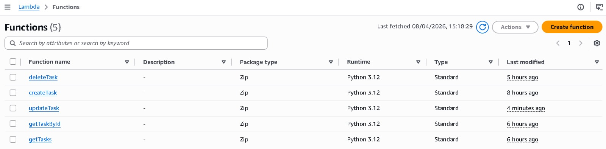
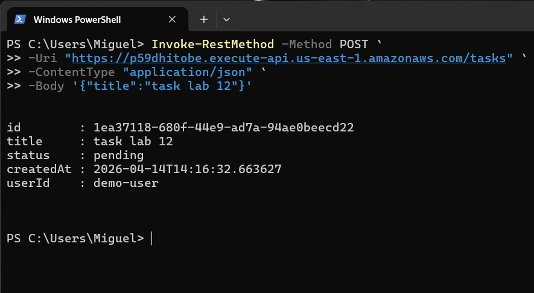
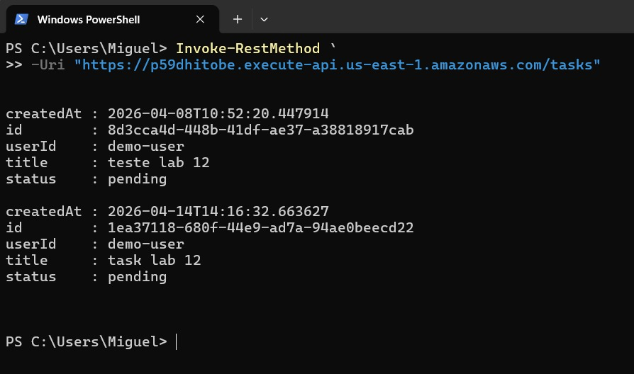
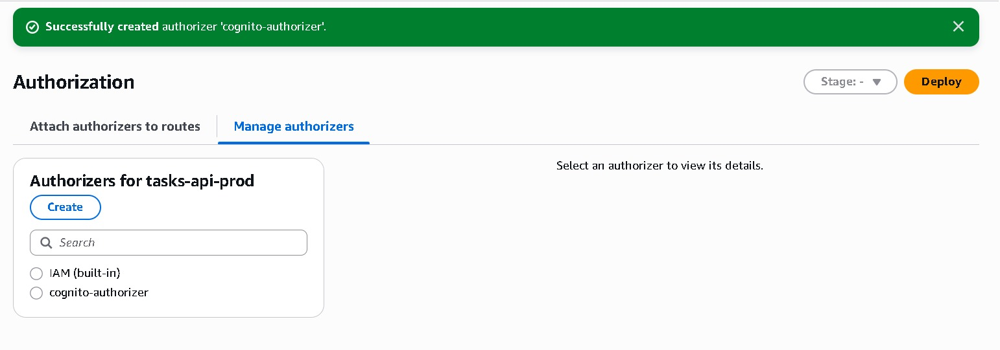
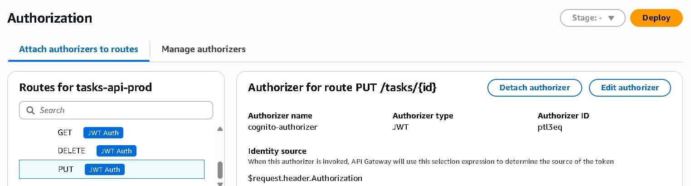
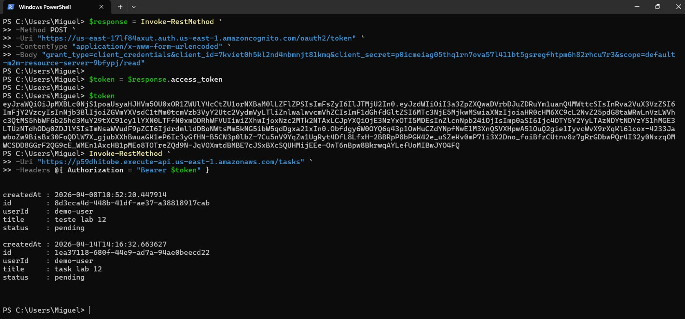
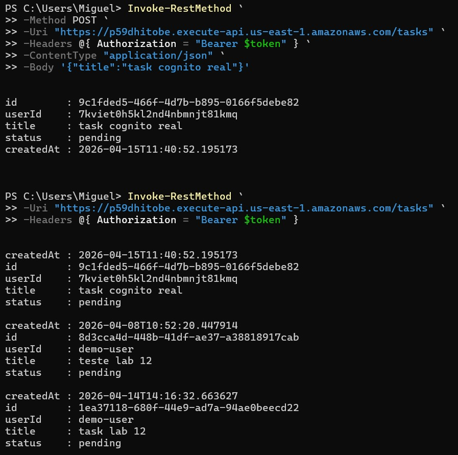

# 🚀 Lab 12 — API Serverless Protegida (API Gateway + Lambda + DynamoDB + Cognito)

## 🏗 Arquitetura

```
Client
  │
  ▼
Amazon Cognito (JWT Token)
  │
  ▼
API Gateway (JWT Authorizer)
  │
  ▼
Lambda Function
  │
  ▼
DynamoDB (userId partition key)
```

Este laboratório evolui a API serverless criada anteriormente adicionando autenticação utilizando Amazon Cognito e validação de JWT no API Gateway.  
O objetivo foi transformar uma API pública em uma API multi-usuário segura, onde apenas usuários autenticados podem acessar os dados.

---

## 🎯 Objetivo

Implementar autenticação gerenciada e proteger rotas da API garantindo:

- Acesso apenas para usuários autenticados  
- Identificação única por usuário  
- Isolamento de dados (multi-tenant)  
- Segurança sem backend de autenticação próprio  

---

## 🔐 Autenticação com Cognito

O Amazon Cognito foi utilizado como provedor de identidade responsável pela autenticação e geração de tokens JWT.  
Essa escolha elimina a necessidade de implementar manualmente login, armazenamento de usuários e assinatura de tokens.

O cliente solicita um token ao Cognito e recebe um JWT assinado contendo informações do usuário.  
Esse token é enviado no header Authorization para o API Gateway.

Essa abordagem permite autenticação gerenciada, escalável e integrada nativamente com a AWS.

---

## 🛡 Proteção da API com JWT Authorizer

O API Gateway foi configurado com JWT Authorizer apontando para o Cognito como issuer.  
Com isso, o token é validado antes da requisição chegar à Lambda.

Requests sem token ou com token inválido são bloqueadas automaticamente pelo API Gateway.  
A Lambda passa a executar apenas para requisições autenticadas, reduzindo custo e centralizando a segurança.

---

## 👤 Identificação do Usuário

Após a validação do JWT, o API Gateway injeta os claims do token no evento da Lambda.  
O identificador único do usuário é obtido do claim `sub`.

```python
claims = event["requestContext"]["authorizer"]["jwt"]["claims"]
user_id = claims["sub"]
```

Esse valor é utilizado como `userId` no DynamoDB, permitindo separar os dados por usuário.

Essa estratégia transforma a API em multi-tenant utilizando apenas uma tabela.

---

## 🔄 Evolução em relação ao Lab anterior

Lab anterior:

- API pública  
- Usuário fixo  
- Sem autenticação  
- Dados compartilhados  

Este laboratório:

- API protegida  
- Usuário autenticado  
- JWT validation  
- Multi-tenant  
- Isolamento por usuário  

---

## ⚖️ Decisão de Arquitetura

Foi escolhido Amazon Cognito em vez de autenticação manual.

Cognito fornece:

- Gerenciamento de usuários  
- Geração de JWT  
- Assinatura de tokens  
- Integração com API Gateway  
- Escalabilidade automática  

Uma implementação manual exigiria:

- Banco de usuários  
- Hash de senha  
- JWT custom  
- Refresh tokens  
- Rotação de chaves  
- Manutenção de segurança  

---

## ✅ Resultado

Este laboratório implementa:

- API serverless protegida  
- Autenticação com Cognito  
- Validação JWT no API Gateway  
- Identificação por usuário  
- Multi-tenant com DynamoDB  
- Arquitetura segura  
- Backend serverless pronto para produção

  📸 ScreenShots


   

   

   

   
  
   

   

   
     

