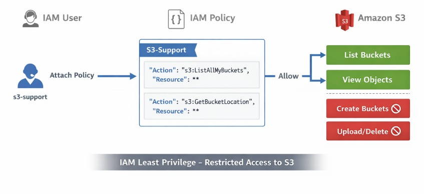

# AWS Lab 08 — IAM Least Privilege

Este laboratório teve como objetivo praticar e demonstrar na prática o princípio de **Least Privilege (Privilégio Mínimo)** utilizando os serviços de identidade e armazenamento da **AWS**.

O princípio de **Least Privilege** é um dos fundamentos de segurança em cloud computing e consiste em conceder a um usuário, aplicação ou serviço **apenas as permissões estritamente necessárias para executar sua função**, evitando acessos excessivos que possam aumentar riscos de segurança.

Durante o laboratório foi utilizado o serviço **AWS Identity and Access Management (IAM)** para controlar permissões e o **Amazon S3** como recurso alvo para teste de acesso.

## Objetivo do laboratório

Configurar um usuário com permissões restritas para acessar o serviço de armazenamento da AWS, permitindo apenas operações específicas e bloqueando ações administrativas ou potencialmente destrutivas.

## Etapas realizadas

Inicialmente foi realizado o login no console da AWS utilizando um usuário de laboratório. Após o acesso, foi validado que o usuário **não possuía permissões para acessar o serviço Amazon S3**, resultando em erro de **Access Denied**, o que demonstra o comportamento padrão de segurança da AWS quando nenhuma política de acesso está associada ao usuário.

Em seguida foi acessado o serviço **IAM (Identity and Access Management)** para criação de uma política personalizada.

Foi criada uma **IAM Policy** utilizando o editor JSON com permissões mínimas necessárias para permitir apenas a visualização de buckets no Amazon S3. A política criada concedeu permissão para as ações:

- `s3:ListAllMyBuckets`
- `s3:GetBucketLocation`

Essas ações permitem apenas listar os buckets existentes e verificar sua localização, sem permitir qualquer operação de criação, modificação ou exclusão.

Após a criação da policy, ela foi associada ao usuário **s3-support**, demonstrando como políticas podem ser aplicadas diretamente a identidades dentro da AWS.

## Validação das permissões

Após anexar a política ao usuário, foram realizados testes de acesso no serviço Amazon S3 para validar o comportamento das permissões configuradas.

Os seguintes resultados foram observados:

Permissões permitidas:
- Visualizar a lista de buckets
- Consultar informações básicas de buckets

Permissões bloqueadas:
- Criar buckets
- Enviar arquivos
- Excluir objetos
- Alterar configurações de buckets

Esses testes confirmaram que o usuário possui apenas **permissões de leitura estrutural**, garantindo conformidade com o princípio de **Least Privilege**.

## Conceitos praticados

Durante este laboratório foram aplicados os seguintes conceitos fundamentais da AWS:

- AWS IAM (Identity and Access Management)
- Criação de políticas de acesso (IAM Policies)
- Uso de permissões baseadas em JSON
- Controle de acesso a serviços da AWS
- Princípio de segurança Least Privilege
- Validação de permissões utilizando testes práticos

## Arquitetura do laboratório

O fluxo de autorização implementado segue o modelo:

